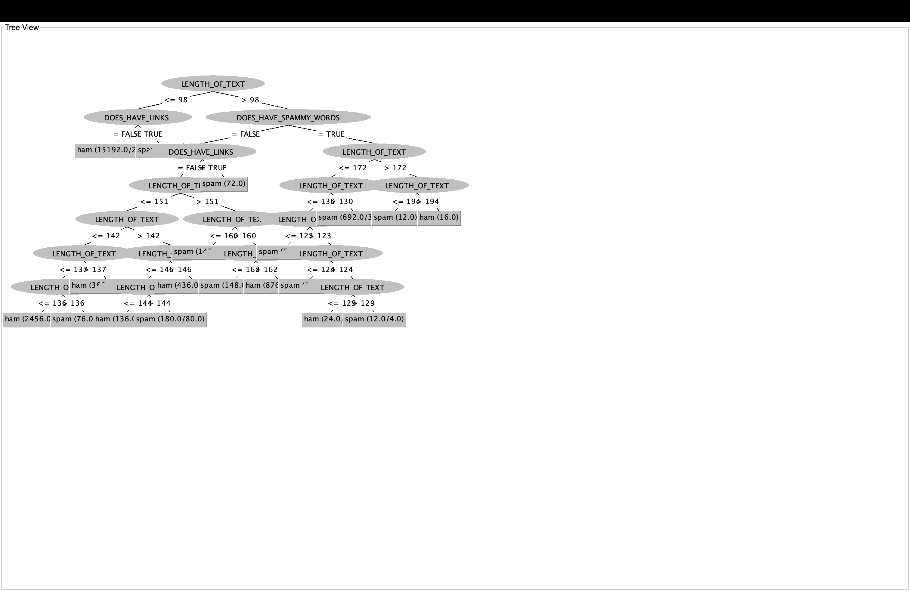

# 📧 Spam Classification with Decision Trees

This repository contains a machine learning project that classifies text messages as either **spam** or **ham (non-spam)** using a **Decision Tree** classifier. The project emphasizes **interpretability** through simple feature engineering and tree visualization.

## 🗂 Project Structure

- `final_part_one.py`  
  Handles **data preprocessing**, including:
  - Loading and cleaning the dataset
  - Feature engineering (e.g., `LENGTH_OF_TEXT`, `DOES_HAVE_LINKS`, `DOES_HAVE_SPAMMY_WORDS`)
  - Splitting the dataset into training and testing sets

- `final_part_two.py`  
  Performs:
  - Training a Decision Tree classifier
  - Model evaluation (accuracy, precision, recall, etc.)
  - Tree visualization

- `final_tree_view.png`  
  Final decision tree visual that illustrates how the model classifies text messages based on extracted features.

## 📊 Features Used

- `LENGTH_OF_TEXT`: Number of characters in the message  
- `DOES_HAVE_LINKS`: Boolean indicator for presence of hyperlinks  
- `DOES_HAVE_SPAMMY_WORDS`: Boolean flag for presence of spam-associated terms  

## 🌲 Example Tree



The above image is the final decision tree model, demonstrating how the classifier uses thresholds on text features to predict spam vs ham.

## 🚀 How to Run

1. Install dependencies (if needed):
   ```bash
   pip install pandas scikit-learn matplotlib
   ```

2. Run preprocessing:
   ```bash
   python final_part_one.py
   ```

3. Train the model and generate the visualization:
   ```bash
   python "final_part_two.py"
   ```

## 🧠 Model Evaluation

- Evaluation results are printed to the console in `final_part_two 2.py`, including:
  - Accuracy
  - Confusion Matrix
  - Precision/Recall metrics

## 📌 Notes

- Assumes the use of a public SMS spam dataset (e.g., from UCI or Kaggle).
- The decision tree is intentionally shallow to keep the model interpretable.
- This project is meant for educational and demonstrative purposes.

---

Feel free to contribute or suggest improvements!
